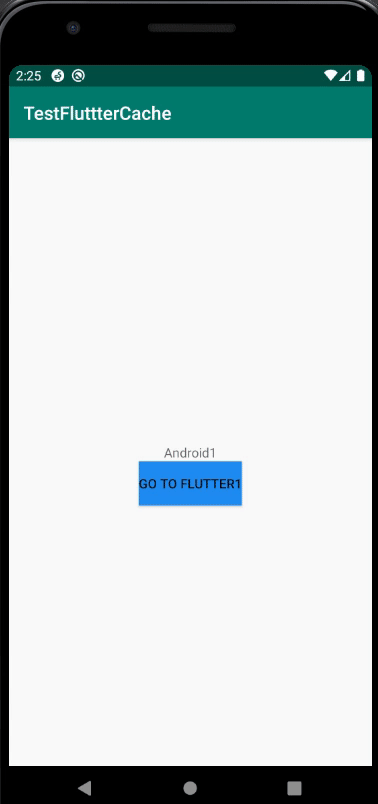

# FlutterView-in-Android
this project implement FlutterView in Android with flutterEngine cached to improve performance, using EventChannel and MethodChannel to navigate to exact route between native AndroidView and FlutterView 
   
scenario: AndroidScreen1 -> FlutterScreen1 -> AndroidScreen2 -> FlutterScreen2 -> AndroidScreen3 -> FlutterScreen3 and go back 
(notice that the state is still preserved) 

(i've overridden the back button to finish current Flutter activity)
